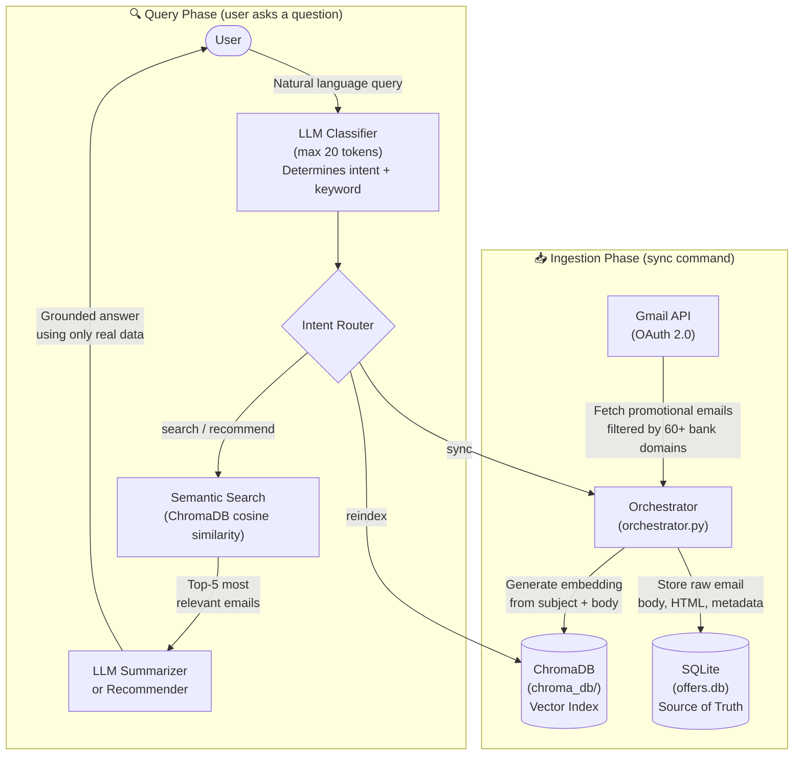

# 💳 Financial Offer Intelligence Agent (RAG)

> [!WARNING]
> 🚧 **Work in Progress** — This project is under active development. Features, APIs, and documentation may change without notice.

A privacy-first, AI-powered agent that **centralizes all credit card and bank promotional emails** across multiple accounts and family members into a single, intelligent chat interface — powered entirely by local LLMs and **Retrieval-Augmented Generation (RAG)**.

> **Why this exists:** Indian banks (SBI, HDFC, ICICI, Axis, Amex, etc.) send hundreds of promotional emails about cashback offers, reward point deals, and discounts — scattered across different Gmail accounts of different family members. These offers pile up unread and expire unused. This agent pulls them all into one place, understands them semantically, and lets you ask questions like *"What offers do I have for Amazon?"* or *"Best card for booking flights?"* — and get accurate, grounded answers backed by your real email data.

### 🎯 The Vision

1. **Centralize** — Aggregate promotional emails from all banks and all family members' Gmail accounts into a single searchable knowledge base.
2. **Optimize** — Use semantic search and LLM-powered recommendations to surface the best credit card for every purchase, so no offer goes unused.
3. **Notify** *(coming soon)* — Proactively alert users with the best available offer based on their spending patterns, before they checkout.

---

## 🏗️ System Design & Architecture

### High-Level Overview

The system follows a **two-phase architecture**:

1. **Ingestion Phase** — Emails are fetched from Gmail, stored permanently in SQLite, and embedded as vectors in ChromaDB.
2. **Query Phase** — User questions are classified by an LLM, relevant emails are retrieved via semantic search, and the LLM generates a grounded answer using only the retrieved data.



---

## ⚙️ How It Works — Step by Step

### Phase 1: Ingestion (`sync` command)

When you type `sync`, the following pipeline executes:

```
Step 1: Gmail API Authentication
├── OAuth 2.0 flow via Google Cloud credentials.json
├── Supports MULTIPLE Gmail accounts (each gets its own token file)
└── Scopes: gmail.readonly + userinfo.email

Step 2: Email Filtering
├── Queries Gmail for emails matching 60+ Indian financial institution domains
├── Includes legacy domains (hdfcbank.com, icicibank.com, sbicard.com)
├── Includes new RBI-mandated .bank.in domains (hdfc.bank.in, icici.bank.in)
├── Also covers: NBFCs (Bajaj Finserv, OneCard, Slice), Card Networks (Amex)
├── And aggregators (CRED)
└── Only fetches emails newer than the last sync timestamp (incremental sync)

Step 3: Storage in SQLite (offers.db)
├── Each email is stored with: email_id, sender, subject, date, body_text, body_html, labels
├── Deduplication via unique email_id index
├── Tracks which Gmail account each email came from (account_email field)
└── processed_status field tracks pipeline state (PENDING → STORED)

Step 4: Embedding in ChromaDB (chroma_db/)
├── Embedding text = subject + first 1000 chars of body
├── Converted to a 384-dimensional vector using all-MiniLM-L6-v2
├── Stored with metadata: subject, sender, date_received, account_email
├── Uses HNSW index with cosine similarity for fast nearest-neighbor search
└── Skips emails already in the vector index (idempotent)
```

> **Daily sync lock:** The system writes today's date to `.last_sync` after each sync. Running `sync` again on the same day returns "Already synced today" to prevent redundant Gmail API calls.

### Phase 2: Querying (Search / Recommend)

When you ask a question, the RAG pipeline processes it in 4 steps:

#### Step 1 — Intent Classification (LLM Call #1)

The LLM receives a bounded prompt (max 20 output tokens) and returns two things:
- **Intent**: One of `greeting`, `sync`, `reindex`, `search`, or `recommend`
- **Keyword**: The specific bank/brand/product mentioned (e.g., "SBI", "Amazon", "travel")

```
Example:
  User Input: "What cashback offers does HDFC have?"
  LLM Output: "search:HDFC"
```

The classifier has a **fallback mechanism** — if the LLM call fails (e.g., LM Studio isn't running), it falls back to simple keyword matching to determine intent.

#### Step 2 — Semantic Retrieval (No LLM Needed)

The keyword (or full user query) is converted to a vector embedding using the same `all-MiniLM-L6-v2` model, and ChromaDB returns the **5 most semantically similar emails** using cosine distance.

This is where semantic search shines over keyword search:

| User Query | Semantic Search (current) |
|---|---|
| "cashback on food" | ✅ Finds Swiggy, Zomato, Dominos, food delivery offers |
| "travel deals" | ✅ Finds flights, hotels, MakeMyTrip, Cleartrip |
| "loan offers" | ✅ Finds education loans, home loans, car loans, EMI offers |
| "entertainment"| ✅ Finds BookMyShow, Inox, movie discounts |

#### Step 3 — Context Augmentation

The Top-5 retrieved emails are formatted into a structured text block with date, sender, subject, body preview, and similarity score. This block becomes the **context window** for the LLM.

```
--- Email 1 (similarity: 0.847) ---
Date: 2026-03-10
From: offers@hdfcbank.com
Subject: 10% Cashback on Amazon with HDFC Credit Cards!
Body: [truncated email body]

--- Email 2 (similarity: 0.791) ---
...
```

#### Step 4 — Grounded Generation (LLM Call #2)

The LLM receives a strict system prompt that says:
- **ONLY use the retrieved email data** — never invent information
- Summarize dates, subjects, senders, and key details
- Look for expiry dates or deadlines in the email body
- Be helpful, concise, and conversational

For `recommend` intent, the system prompt additionally asks the LLM to compare offers and recommend the best credit card considering cashback percentages, discount caps, and minimum spend requirements.

---

## 🧠 Models Used

This system is designed for **100% local, offline execution** to guarantee that your financial email data never leaves your machine.

| Model | Type | Purpose | Size | Where It Runs |
|---|---|---|---|---|
| **all-MiniLM-L6-v2** | Sentence Transformer | Converts email text into 384-dimensional vector embeddings for semantic similarity search | ~80 MB | Locally, auto-downloaded by ChromaDB on first run |
| **Llama 3.2 3B Instruct** | Large Language Model | Intent classification, email summarization, card recommendations | ~2 GB | Locally via [LM Studio](https://lmstudio.ai/) |

### How the LLM is Used (3 Distinct Roles)

| Role | What It Does | Token Budget | Temperature |
|---|---|---|---|
| **Classifier** | Determines user intent + extracts search keyword from the query | max 20 output tokens | 0.0 (deterministic) |
| **Summarizer** | Reads retrieved emails and summarizes them for the user | Unbounded (streaming) | 0.1 (low creativity) |
| **Recommender** | Compares retrieved offers and recommends the best credit card | Unbounded (streaming) | 0.1 (low creativity) |

> **Model Flexibility:** You can swap `Llama 3.2 3B` with any model supported by LM Studio (Mistral, Phi-3, Qwen, Gemma, etc.) by simply loading a different model in LM Studio. The app connects via the OpenAI-compatible API at `http://localhost:1234/v1`. Just make sure your model's context length is ≥ 4096 tokens.

---

## 📁 Project Structure

```
CreditCardOptimizer/
├── chat.py                # Main chat interface — RAG pipeline (classifier → retriever → summarizer)
├── vector_store.py        # ChromaDB wrapper — embedding, semantic search, reindex
├── orchestrator.py        # Sync pipeline — Gmail → SQLite → ChromaDB (no LLM during sync)
├── gmail_collector.py     # Gmail API client — OAuth, 60+ Indian bank domain filters
├── database.py            # SQLite ORM (SQLAlchemy) — raw email storage, dedup, queries
├── models.py              # Data models — Pydantic schemas + SQLAlchemy table definitions
├── setup.py               # First-time setup wizard — .env creation, DB init, Gmail OAuth
├── cli.py                 # Alternative CLI interface (Typer) — sync, recommend, list-offers
├── mcp_server.py          # MCP (Model Context Protocol) server — exposes tools for agent-to-agent use
├── llm_extractor.py       # Legacy: LLM-based structured JSON extraction (replaced by RAG approach)
├── recommendation.py      # Legacy: Rule-based recommendation engine using extracted OfferModel data
├── requirements.txt       # Python dependencies
├── Dockerfile             # Python 3.12-slim container with sqlite3
├── docker-compose.yml     # Services: agent (chat.py) + setup (setup.py)
├── .env                   # Environment variables (LM Studio URL, API key, DB URL)
├── credentials.json       # Google Cloud OAuth Client ID (you provide this)
├── .credentials/          # OAuth tokens per Gmail account (auto-generated)
├── offers.db              # SQLite database — raw emails source of truth
└── chroma_db/             # ChromaDB vector index — embeddings + metadata
```

## 💾 Storage: Why Two Databases?

| Store | Technology | Location | What It Stores | Role |
|---|---|---|---|---|
| **Relational DB** | SQLite (via SQLAlchemy) | `offers.db` | Full raw emails: body text, HTML, sender, subject, date, labels, account | **Source of Truth** — permanent storage, deduplication, incremental sync timestamps |
| **Vector DB** | ChromaDB (via `chromadb` Python SDK) | `chroma_db/` | 384-dim embeddings + metadata (subject, sender, date) | **Search Index** — enables semantic similarity search |

### Key Relationships

```
┌─────────────────────────────────┐
│  SQLite (offers.db)             │
│  ┌───────────────────────────┐  │
│  │ raw_emails table          │  │
│  │ - email_id (unique, PK)   │  │
│  │ - sender                  │  │
│  │ - subject                 │  │
│  │ - date_received           │  │
│  │ - body_text (full)        │  │
│  │ - body_html (full)        │  │
│  │ - labels (JSON)           │  │
│  │ - account_email           │  │
│  │ - processed_status        │  │
│  └───────────────────────────┘  │
│  ┌───────────────────────────┐  │
│  │ offers table (legacy)     │  │
│  │ - merchant, card_name     │  │
│  │ - discount_percent        │  │
│  │ - min_spend, max_cashback │  │
│  │ - valid_from, valid_until │  │
│  │ - unique_hash             │  │
│  └───────────────────────────┘  │
└─────────────────────────────────┘
          │
          │ reindex command reads
          │ all raw_emails from SQLite
          │ and re-embeds them
          ▼
┌─────────────────────────────────┐
│  ChromaDB (chroma_db/)          │
│  ┌───────────────────────────┐  │
│  │ promotional_emails        │  │
│  │ collection                │  │
│  │ - id = email_id           │  │
│  │ - document = subj + body  │  │
│  │ - embedding = 384-dim vec │  │
│  │ - metadata = {subject,    │  │
│  │     sender, date, account}│  │
│  └───────────────────────────┘  │
└─────────────────────────────────┘
```
---

## 🚀 How to Run

### Prerequisites

| Requirement | Why |
|---|---|
| [LM Studio](https://lmstudio.ai/) | Hosts the local LLM. Start the server on port `1234` and load a model (Llama 3.2 3B Instruct recommended). |
| Google Cloud `credentials.json` | Required for Gmail API OAuth. Enable the Gmail API in [Google Cloud Console](https://console.cloud.google.com/), create an OAuth 2.0 Desktop Client ID, and download the JSON file. |
| Docker & Docker Compose | For the containerized method (recommended). |
| Python 3.12+ | For the local method (alternative). |

### Method 1: Docker 🐳 (Recommended)

```bash
# 1. Place credentials.json in the project root directory

# 2. Create a .env file:
cat > .env << 'EOF'
LMSTUDIO_BASE_URL=http://host.docker.internal:1234/v1
LMSTUDIO_API_KEY=lm-studio
DATABASE_URL=sqlite:///offers.db
EOF
# NOTE: Use host.docker.internal (Mac/Windows) or your machine's
# LAN IP address (Linux) to reach LM Studio from inside Docker.

# 3. Build the Docker image
docker compose build

# 4. First-time setup: authenticate Gmail accounts
docker compose run --rm setup

# 5. Start the interactive RAG agent
docker compose run --rm agent
```

**What Docker mounts (persistent across restarts):**
| Volume | Purpose |
|---|---|
| `./.credentials:/app/.credentials` | Gmail OAuth tokens (one per account) |
| `./offers.db:/app/offers.db` | SQLite database |
| `./credentials.json:/app/credentials.json` | Google Cloud OAuth Client ID |
| `./.env:/app/.env` | Environment variables |
| `./.last_sync:/app/.last_sync` | Daily sync lock file |

### Method 2: Local Python

```bash
# 1. Create a virtual environment
conda create -n cred-env python=3.12 -y
conda activate cred-env

# 2. Install dependencies
pip install -r requirements.txt

# 3. Create .env file
cat > .env << 'EOF'
LMSTUDIO_BASE_URL=http://localhost:1234/v1
LMSTUDIO_API_KEY=lm-studio
DATABASE_URL=sqlite:///offers.db
EOF

# 4. Run the setup wizard (creates DB schema, authenticates Gmail)
python setup.py

# 5. Start the interactive RAG agent
python chat.py
```

---

## 💬 Usage

Once the agent is running, interact using natural language:

```
Financial Offer Intelligence Agent (RAG) is online!
Vector DB: x emails indexed
Commands: sync, search, recommend, reindex, exit

You: sync                          → Fetches & embeds new promotional emails from Gmail
You: reindex                       → Rebuilds ChromaDB vector index from SQLite
You: SBI offers                    → Semantic search for SBI-related emails
You: cashback on food              → Finds Swiggy/Zomato/Dominos offers (semantic match!)
You: travel deals                  → Finds flight/hotel/MakeMyTrip offers
You: latest HDFC and ICICI offers  → Semantic search across multiple banks
You: best card for Amazon          → Recommends card based on real promotional data
You: exit                          → Closes the agent
```

### Alternative: CLI Interface

For scriptable, non-interactive usage:

```bash
python cli.py init                          # Initialize database
python cli.py add-account                   # Authenticate a Gmail account
python cli.py list-accounts                 # Show configured accounts
python cli.py sync                          # Sync all accounts
python cli.py sync --account user@gmail.com # Sync specific account
python cli.py recommend amazon 5000         # Best card for ₹5000 on Amazon
python cli.py list-offers                   # Show all stored offers
```

---

## 🔧 Environment Variables

| Variable | Default | Description |
|---|---|---|
| `LMSTUDIO_BASE_URL` | `http://localhost:1234/v1` | URL of the LM Studio local server (OpenAI-compatible API) |
| `LMSTUDIO_API_KEY` | `lm-studio` | API key for LM Studio (default works for local) |
| `DATABASE_URL` | `sqlite:///offers.db` | SQLAlchemy connection string for the relational database |

---

## 🎯 Key Design Decisions

1. **RAG over LLM Extraction** — Instead of asking the LLM to extract structured JSON from every email at sync time (which is slow and unreliable with 3B parameter models), we store emails raw and retrieve them semantically at query time. The LLM only processes 5 emails per query, not hundreds.

2. **LLM as a Bounded Classifier** — The intent classifier uses a single LLM call capped at 20 output tokens with `temperature=0.0`. This ensures deterministic, fast classification without autonomous loops or runaway generation.

3. **Embeddings Run Locally** — `all-MiniLM-L6-v2` (~80 MB) runs entirely on CPU via ChromaDB. No cloud API calls, no API keys, no data leaving your machine.

4. **Multi-Account Support** — The system supports multiple Gmail accounts. Each account gets its own OAuth token stored in `.credentials/token_<email>.json`.

5. **Incremental Sync** — On each sync, the system queries SQLite for the most recent email date per account and only fetches newer emails from Gmail, minimizing API usage.

6. **RBI `.bank.in` Domain Support** — Indian banking regulator (RBI) mandated new `.bank.in` domains. The email filter includes both legacy domains (`hdfcbank.com`) and new domains (`hdfc.bank.in`) to ensure no promotional emails are missed.

7. **Dual Storage Architecture** — SQLite is the permanent source of truth (supports re-syncing, dedup, reindexing). ChromaDB is a derived search index that can be fully rebuilt anytime from SQLite using the `reindex` command.

---

## 🗺️ Roadmap

- [x] Multi-account Gmail sync (aggregate across family members)
- [x] RAG-powered semantic search and summarization
- [x] Credit card recommendation engine
- [x] Docker support with persistent storage
- [x] MCP server for agent-to-agent interoperability
- [ ] **Smart Notifications** — Proactively notify users of the best offer to use based on their spending patterns and transaction history
- [ ] **Spend Tracking Integration** — Connect to UPI/bank statements to auto-detect purchases and trigger offer alerts
- [ ] **Family Dashboard** — Web UI to visualize all offers across family members in one place
- [ ] **Offer Expiry Alerts** — Notify before high-value offers expire
- [ ] **WhatsApp/Telegram Bot** — Chat with the agent outside the terminal
